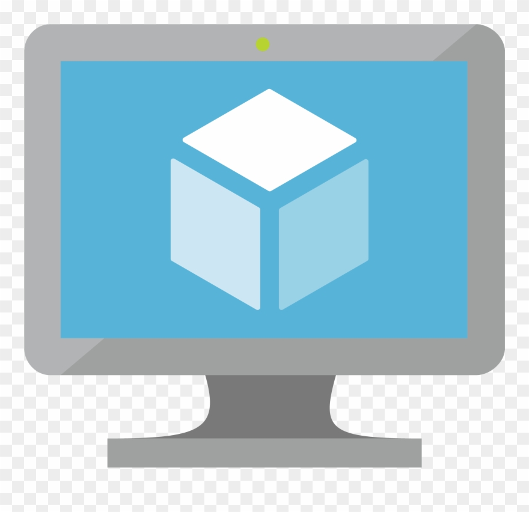

# Infra Multiverse

The biggest crossover since the MCU

* [Cloud](#cloud)
* [CI/CD](#CI-CD)

## Cloud 
<!-- ALL-TOPICS-LIST:START -->
<!-- prettier-ignore-start -->
<!-- markdownlint-disable -->

<table>
  <tr>
    <td align="center"><b></b></td>
    <td align="center"><a href="#git"> <b>AWS</b></a></td>
    <td align="center"><a href="#git"> <b>Azure</b></a></td>
    <td align="center"><a href="#ansible"> <b>GCP</b></a></td>
    <td align="center"><a href="#openstack"> <b>OpenStack</b></a></td>

  </tr>
  <tr>
    <td align="center">Compute<b></b></td>
    <td align="center"><a href="#ec2"> <b>EC2</b></a></td>
    <td align="center"><a href="#virtual-machines"> <b>Virtual Machines</b></a></td>
    <td align="center"><a href="#compute-engine"> <b>Compute Engine</b></a></td>
    <td align="center"><a href="#nova"> <b>Nova</b></a></td>
  </tr>
    <tr>
    <td align="center">Network<b></b></td>
    <td align="center"><a href="#ec2"> <b>EC2</b></a></td>
    <td align="center"><a href="#virtual-machines"> <b>Virtual Machines</b></a></td>
    <td align="center"><a href="#compute-engine"> <b>Compute Engine</b></a></td>
    <td align="center"><a href="#neutron"> <b>Neutron</b></a></td>
  </tr>
    <tr>
    <td align="center">Object Storage<b></b></td>
    <td align="center"><a href="#ec2"> <b>EC2</b></a></td>
    <td align="center"><a href="#virtual-machines"> <b>Blob Storage</b></a></td>
    <td align="center"><a href="#compute-engine"> <b>Compute Engine</b></a></td>
    <td align="center"><a href="#neutron"> <b>Swift</b></a></td>
  </tr>
    <tr>
    <td align="center">Block Storage<b></b></td>
    <td align="center"><a href="#ec2"> <b>EC2</b></a></td>
    <td align="center"><a href="#virtual-machines"> <b>Virtual Machines</b></a></td>
    <td align="center"><a href="#compute-engine"> <b>Compute Engine</b></a></td>
    <td align="center"><a href="#neutron"> <b>Cinder</b></a></td>
  </tr>
    <tr>
    <td align="center">Image<b></b></td>
    <td align="center"><a href="#ec2"> <b>EC2</b></a></td>
    <td align="center"><a href="#virtual-machines"> <b>Virtual Machines</b></a></td>
    <td align="center"><a href="#compute-engine"> <b>Compute Engine</b></a></td>
    <td align="center"><a href="#neutron"> <b>Glance</b></a></td>
  </tr>
      <tr>
    <td align="center">Identity<b></b></td>
    <td align="center"><a href="#ec2"> <b>EC2</b></a></td>
    <td align="center"><a href="#virtual-machines"> <b>Active Directory</b></a></td>
    <td align="center"><a href="#compute-engine"> <b>Compute Engine</b></a></td>
    <td align="center"><a href="#neutron"> <b>Keystone</b></a></td>
  </tr>
    <tr>
    <td align="center">Load Balancer<b></b></td>
    <td align="center"><a href="#elastc-load-balancing"> <b>Elastic Load Balancing</b></a></td>
    <td align="center"><a href="#virtual-machines"> <b>Load Balancer</b></a></td>
    <td align="center"><a href="#compute-engine"> <b>Compute Engine</b></a></td>
    <td align="center"><a href="#neutron"> <b>Octavia</b></a></td>
  </tr>
</table>

<!-- markdownlint-enable -->
<!-- prettier-ignore-end -->
<!-- ALL-TOPICS-LIST:END -->
