

The most ambitious crossover in history since the MCU.
An educational repository regarding the different platforms and projects in the infrastructure world.

Disclaimer: the project in some parts is opininated

- [Cloud](#cloud)
  - [Services](#services)
- [CI/CD](#cicd)
  - [CI/CD - Platforms](#cicd---platforms)
  - [CI/CD - Configuration](#cicd---configuration)
- [Configuration Management](#configuration-management)
- [Dashboards](#dashboards)
- [Provisioning](#provisioning)
- [Monitoring](#monitoring)
- [More Infra related projects](#more-infra-related-projects)
  - [Contribute](#contribute)
  - [License](#license)

## Cloud 

### Services
<!-- ALL-TOPICS-LIST:START -->
<!-- prettier-ignore-start -->
<!-- markdownlint-disable -->

<table>
  <tr>
    <td align="center"><b></b></td>
    <td align="center"><a href="#git"> <b>AWS</b></a></td>
    <td align="center"><a href="#git"> <b>Azure</b></a></td>
    <td align="center"><a href="#ansible"> <b>GCP</b></a></td>
    <td align="center"><a href="#openstack"> <b>OpenStack</b></a></td>
    <td align="center"><b>Open Source Alternatives or Solutions</b></a></td>

  </tr>
  <tr>
    <td align="center">Compute<b></b></td>
    <td align="center"><a href="#ec2"> <b>EC2</b></a></td>
    <td align="center"><a href="#virtual-machines"> <b>Virtual Machine</b></a></td>
    <td align="center"><a href="#compute-engine"> <b>Compute Engine</b></a></td>
    <td align="center"><a href="#nova"> <b>Nova</b></a></td>
    <td align="center"><a href="#ovirt"> <b>oVirt</b></a></td>
  </tr>
    <tr>
    <td align="center">Network<b></b></td>
    <td align="center"><a href="#ec2"> <b>VPC</b></a></td>
    <td align="center"><a href="#virtual-network"> <b>Virtual Network</b></a></td>
    <td align="center"><a href="#compute-engine">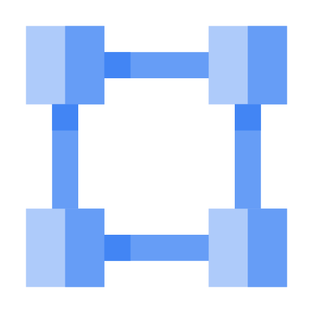 <b>VPC</b></a></td>
    <td align="center"><a href="#neutron"> <b>Neutron</b></a></td>
  </tr>
    <tr>
    <td align="center">Object Storage<b></b></td>
    <td align="center"><a href="#ec2"> <b>s3</b></a></td>
    <td align="center"><a href="#virtual-machines"> <b>Blob Storage</b></a></td>
    <td align="center"><a href="#compute-engine"> <b>Cloud Storage</b></a></td>
    <td align="center"><a href="#neutron"> <b>Swift</b></a></td>
  </tr>
    <tr>
    <td align="center">Block Storage<b></b></td>
    <td align="center"><a href="#ec2">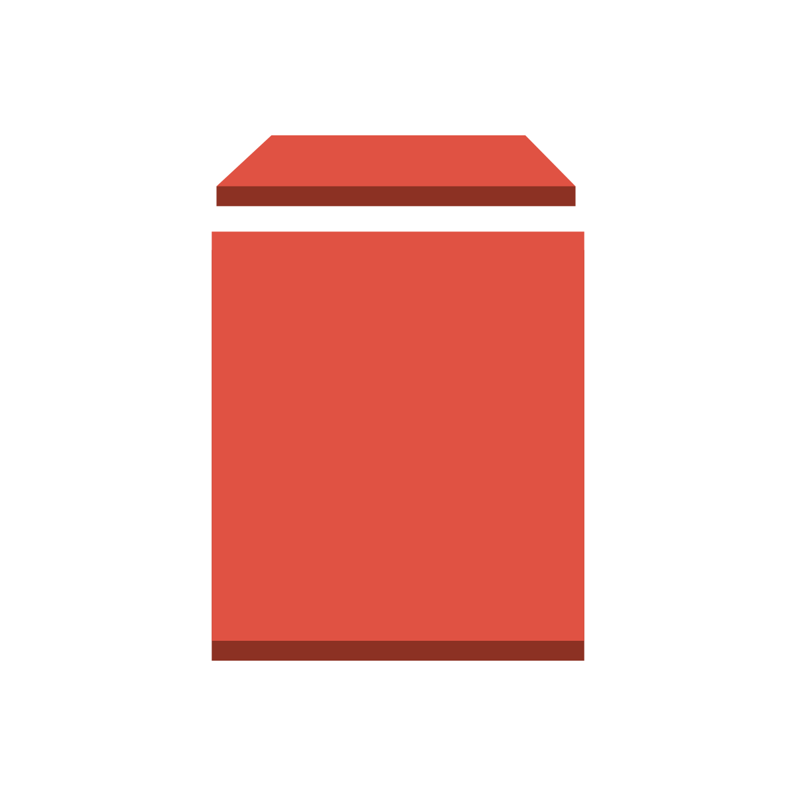 <b>EBS</b></a></td>
    <td align="center"><a href="#disk-storage"> <b>Disk Storage</b></a></td>
    <td align="center"><a href="#compute-engine"> <b>Persistent Disk</b></a></td>
    <td align="center"><a href="#neutron"> <b>Cinder</b></a></td>
  </tr>
    <tr>
    <td align="center">Image<b></b></td>
    <td align="center"><a href="#ec2">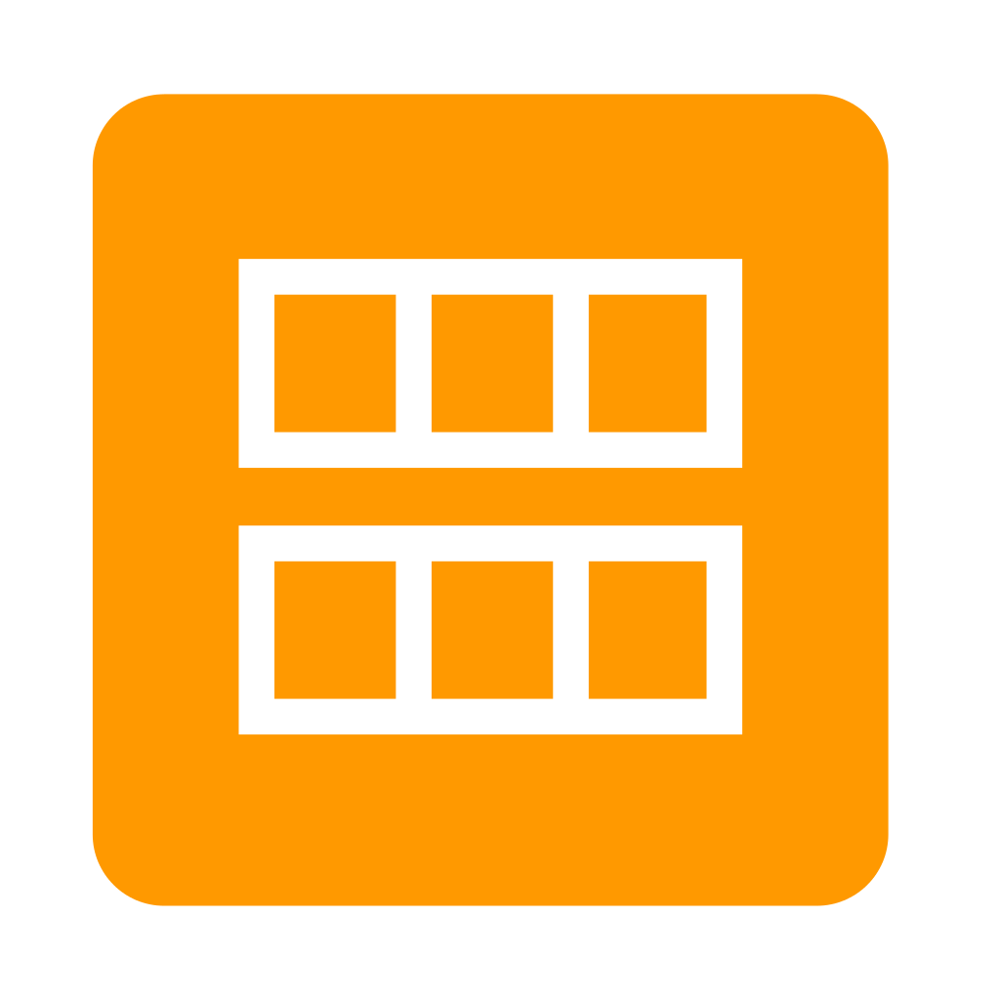 <b>AMI</b></a></td>
    <td align="center"><a href="#virtual-machines"> <b>Images</b></a></td>
    <td align="center"><a href="#compute-engine">   <b>Images</b></a></td>
    <td align="center"><a href="#neutron"> <b>Glance</b></a></td>
  </tr>
      <tr>
    <td align="center">Identity<b></b></td>
    <td align="center"><a href="#ec2"> <b>IAM</b></a></td>
    <td align="center"><a href="#virtual-machines">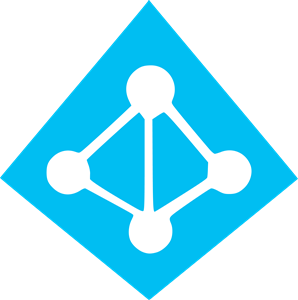 <b>Active Directory</b></a></td>
    <td align="center"><a href="#compute-engine"> <b>Identity</b></a></td>
    <td align="center"><a href="#neutron"> <b>Keystone</b></a></td>
  </tr>
    <tr>
    <td align="center">Load Balancer<b></b></td>
    <td align="center"><a href="#elastc-load-balancing"> <b>Elastic Load Balancing</b></a></td>
    <td align="center"><a href="#virtual-machines">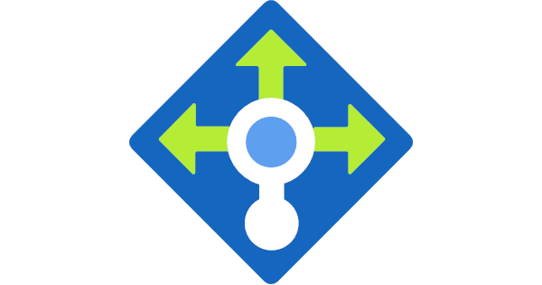 <b>Load Balancer</b></a></td>
    <td align="center"><a href="#compute-engine"> <b>Load Balancing</b></a></td>
    <td align="center"><a href="#neutron"> <b>Octavia</b></a></td>
    <td align="center"> <b>Traefik NGINX HAProxy Seesaw</b></a></td>
  </tr>
  <tr>
    <td align="center">Event/Data Streaming<b></b></td>
    <td align="center"><a href="#kinesis"> <b>Kinesis</b></a></td>
    <td align="center"><a href="#stream_analytics"> <b>Stream Analytics</b></a></td>
    <td align="center"><a href="#pub_sub"> <b>Pub/Sub</b></a></td>
    <td align="center"><a> <b></b></a></td>
    <td align="center"><a> <b>Kafka</b></a></td>
  </tr>
</table>

<!-- markdownlint-enable -->
<!-- prettier-ignore-end -->
<!-- ALL-TOPICS-LIST:END -->

## CI/CD 

### CI/CD - Platforms
<!-- ALL-TOPICS-LIST:START -->
<!-- prettier-ignore-start -->
<!-- markdownlint-disable -->

<table>
  <tr>
    <td align="center"><b></b></td>
    <td align="center"><a href="#git"> <b>Jenkins</b></a></td>
    <td align="center"><a href="#git"> <b>GitLab CI</b></a></td>
    <td align="center"><a href="#ansible">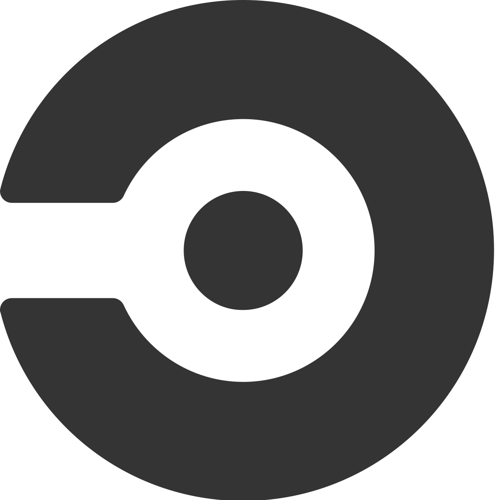 <b>CircleCI</b></a></td>
    <td align="center"><a href="#bamboo"> <b>Bamboo</b></a></td>
     <td align="center"><a href="#oc_pipelines">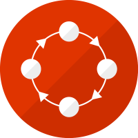 <b>OpenShift Pipelines</b></a></td>
    <td align="center"><a href="#teamcity"> <b>TeamCity</b></a></td>

  </tr>
  <tr>
    <td align="center">OPEN SOURCE<b></b></td>
    <td align="center"><a href="#"> <b></b></a></td>
    <td align="center"><a href="#"> <b></b></a></td>
    <td align="center"><a href="#"> <b></b></a></td>
    <td align="center"><a href="#"> <b></b></a></td>
     <td align="center"><a href="#"> <b></b></a></td>
     <td align="center"><a href="#"> <b></b></a></td>
  </tr>
    <tr>
    <td align="center">Deployment Options<b></b></td>
    <td align="center"><a href="#"> <b>Managed service, On-premise</b></a></td>
     <td align="center"><a href="#"> <b>Hosted, On-premise</b></a></td>
    <td align="center"><a href="#"> <b>Hosted, On-premise</b></a></td>
    <td align="center"><a href="#"> <b>Managed service, On-premise</b></a></td>
    <td align="center"><a href="#"> <b>Depends on how OpenShift was deployed</b></a></td>
    <td align="center"><a href="#"> <b>Managed Service, On-Premise</b></a></td>
  </tr>
    <tr>
    <td align="center">Plugins<b></b></td>
    <td align="center"><a href="#"> <b>Over thousand plugins</b></a></td>
    <td align="center"><a href="#"> <b></b></a></td>
     <td align="center"><a href="#"> <b></b></a></td>
    <td align="center"><a href="#"> <b></b></a></td>
    <td align="center"><a href="#"> <b>Tekton Hub</b></a></td>
    <td align="center"><a href="#"> <b></b></a></td>
  </tr>
    <tr>
    <td align="center">Pipeline/Job/Task Format<b></b></td>
    <td align="center"><a href="#ec2"> <b>Groovy, Pipeline DSL</b></a></td>
    <td align="center"><a href="#ec2"> <b>YAML</b></a></td>
    <td align="center"><a href="#ec2"> <b>YAML</b></a></td>
    <td align="center"><a href="#ec2"> <b>Java TaskType Module definition</b></a></td>
    <td align="center"><a href="#ec2"> <b>Kubernetes YAMLs</b></a></td>
    <td align="center"><a href="#ec2"> <b>Kotlin DSL</b></a></td>
  </tr>
  </tr>
    <tr>
    <td align="center">Best Use Case (imho)<b></b></td>
    <td align="center"><a href="#ec2"> <b>Total Freedom (+ You are not afraid of using Groovy)</b></a></td>
    <td align="center"><a href="#ec2"> <b>When your code is already in Gitlab</b></a></td>
    <td align="center"><a href="#ec2"> <b>When you just want out-of-the-box working CI/CD</b></a></td>
    <td align="center"><a href="#ec2"> <b>No idea</b></a></td>
    <td align="center"><a href="#ec2"> <b>You don't want to maintain a CI/CD server and your CI/CD is mainly containers based</b></a></td>
    <td align="center"><a href="#ec2"> <b>You want versatile CI/CD but don't care about open source</b></a></td>
  </tr>

</table>

<!-- markdownlint-enable -->
<!-- prettier-ignore-end -->
<!-- ALL-TOPICS-LIST:END -->

### CI/CD - Configuration
<!-- ALL-TOPICS-LIST:START -->
<!-- prettier-ignore-start -->
<!-- markdownlint-disable -->

<table>
  <tr>
    <td align="center"><b></b></td>
    <td align="center"><a href="#git"> <b>Jenkins</b></a></td>
    <td align="center"><a href="#git"> <b>GitLab CI</b></a></td>
    <td align="center"><a href="#ansible"> <b>CircleCI</b></a></td>
    <td align="center"><a href="#openstack"> <b>Bamboo</b></a></td>

  </tr>
  <tr>
    <td align="center">Set Node/Worker/Runner<b></b></td>
    <td align="center"><a href="cicd/jenkins/node.md">Slave <b></b></a></td>
    <td align="center"><a href="cicd/gitlab/node.md">Runner <b></b></a></td>
    <td align="center"><a href="cicd/circleci/node.md">Runner <b></b></a></td>
    <td align="center"><a href="cicd/bamboo/node.md">Agent <b></b></a></td>
  </tr>

</table>

<!-- markdownlint-enable -->
<!-- prettier-ignore-end -->
<!-- ALL-TOPICS-LIST:END -->

## Configuration Management
<!-- ALL-TOPICS-LIST:START -->
<!-- prettier-ignore-start -->
<!-- markdownlint-disable -->

<table>
  <tr>
    <td align="center"><b></b></td>
    <td align="center"><a href="#git"> <b>Ansible</b></a></td>
    <td align="center"><a href="#git"> <b>Puppet</b></a></td>
    <td align="center"><a href="#ansible"> <b>Chef</b></a></td>

  </tr>
  <tr>
    <td align="center">OPEN SOURCE<b></b></td>
    <td align="center"><a href="#"> <b></b></a></td>
    <td align="center"><a href="#"> <b></b></a></td>
    <td align="center"><a href="#"> <b></b></a></td>
  </tr>
    <tr>
    <td align="center">Agent  vs.  Agentless<b></b></td>
    <td align="center"><a href="#"> <b>Agentless</b></a></td>
    <td align="center"><a href="#"> <b>Master-Agent</b></a></td>
    <td align="center"><a href="#"> <b>Master-Agent</b></a></td>
  </tr>
    <tr>
    <td align="center">Underlying Programming Language<b></b></td>
    <td align="center"><a href="#"> <b>Python</b></a></td>
    <td align="center"><a href="#"> <b>Ruby</b></a></td>
    <td align="center"><a href="#"> <b>Ruby</b></a></td>
  </tr>
  <tr>
    <td align="center">Push vs. Pull<b></b></td>
    <td align="center"><a href="#"> <b>Both supported. Push is the default</b></a></td>
    <td align="center"><a href="#"> <b>Both supported. Pull is the default</b></a></td>
    <td align="center"><a href="#"> <b>Pull</b></a></td>
  </tr>

</table>

<!-- markdownlint-enable -->
<!-- prettier-ignore-end -->
<!-- ALL-TOPICS-LIST:END -->

## Dashboards
<!-- ALL-TOPICS-LIST:START -->
<!-- prettier-ignore-start -->
<!-- markdownlint-disable -->

<table>
  <tr>
    <td align="center"><b></b></td>
    <td align="center"><a href="#git">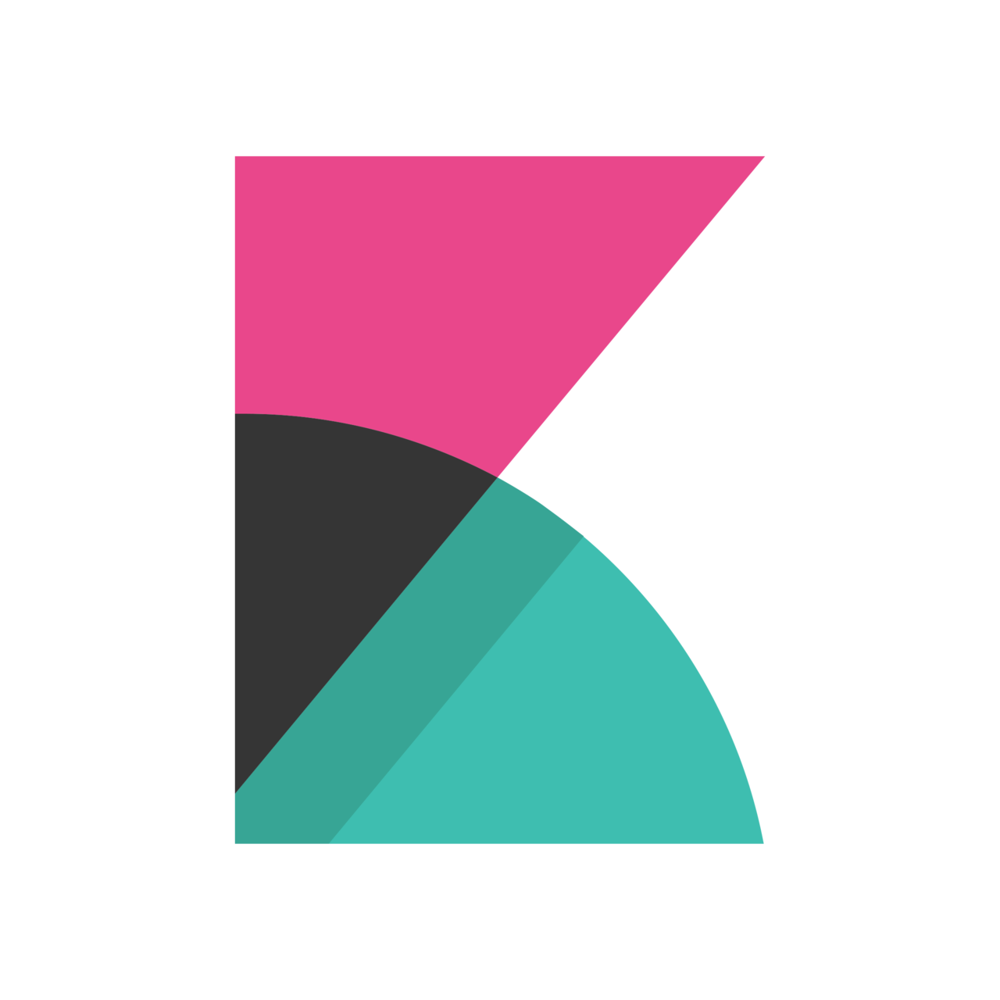 <b>Kibana</b></a></td>
    <td align="center"><a href="#git"> <b>Grafana</b></a></td>
    <td align="center"><a href="#ansible">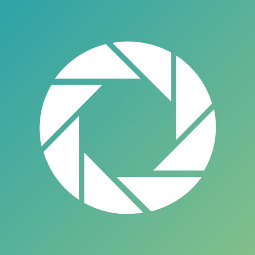 <b>ReportPortal</b></a></td>

  </tr>
  <tr>
    <td align="center">OPEN SOURCE<b></b></td>
    <td align="center"><a href="#"> <b></b></a></td>
    <td align="center"><a href="#"> <b></b></a></td>
    <td align="center"><a href="#"> <b></b></a></td>
  </tr>
    <tr>
    <td align="center">Querying<b></b></td>
    <td align="center"><a href="#"> <b>Lucene and KQL</b></a></td>
    <td align="center"><a href="#"> <b>Based on the data source</b></a></td>
    <td align="center"><a href="#"> <b></b></a></td>
  </tr>
    <tr>
    <td align="center">Supports multiple data sources<b></b></td>
    <td align="center"><a href="#"> <b>Only Elasticsearch</b></a></td>
    <td align="center"><a href="#"> <b></b></a></td>
    <td align="center"><a href="#"> <b></b></a></td>
  </tr>
      <tr>
    <td align="center">Visualizations<b></b></td>
    <td align="center"><a href="#"> <b>Pie charts, Line charts  Data tables, Markdown Geo Maps, Metrics Heat Map</b></a></td>
    <td align="center"><a href="#"> <b>Pie charts, Line charts  Data tables, Markdown Geo Maps, Metrics Heat Map</b></a></td>
     <td align="center"><a href="#"> <b>Pie charts, Line charts  Data tables</b></a></td>
  </tr>
  <tr>
    <td align="center">Best suited for<b></b></td>
    <td align="center"><a href="#"> <b>Logs Analysis</b></a></td>
    <td align="center"><a href="#"> <b>Metrics Analysis</b></a></td>
    <td align="center"><a href="#"> <b>Pattern Analysis</b></a></td>
  </tr>

</table>

<!-- markdownlint-enable -->
<!-- prettier-ignore-end -->
<!-- ALL-TOPICS-LIST:END -->

## Provisioning

Note: Many systems and tools can be used for provisioning (e.g. Ansible). This is focusing on those who were built mainly for this purpose.
<!-- ALL-TOPICS-LIST:START -->
<!-- prettier-ignore-start -->
<!-- markdownlint-disable -->

<table>
  <tr>
    <td align="center"><b></b></td>
    <td align="center"><a href="#git"> <b>Terraform</b></a></td>
    <td align="center"><a href="#git"> <b>Pulumi</b></a></td>
    <td align="center"><a href="#ansible">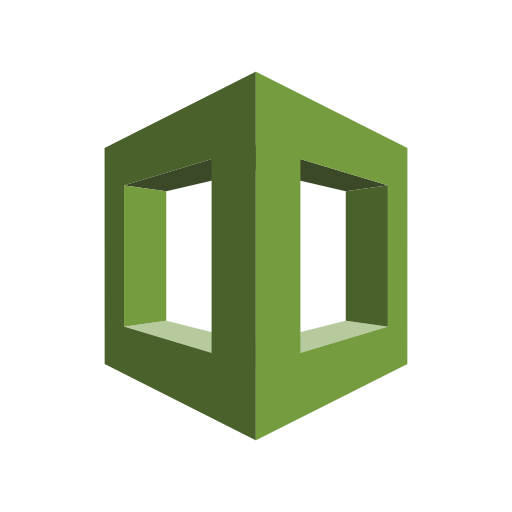 <b>CloudFormation</b></a></td>

  </tr>
  <tr>
    <td align="center">OPEN SOURCE<b></b></td>
    <td align="center"><a href="#"> <b></b></a></td>
    <td align="center"><a href="#"> <b></b></a></td>
    <td align="center"><a href="#"> <b></b></a></td>
  </tr>
    <tr>
    <td align="center">Language<b></b></td>
    <td align="center">DSL (HCL)</td>
    <td align="center">Python, C#, JavaScript,  Go and TypeScript </td>
    <td align="center">JSON or YAML</td>
  </tr>
    <tr>
    <td align="center">Cloud Agnostic<b></b></td>
    <td align="center"><a href="#"> <b></b></a></td>
    <td align="center"><a href="#"> <b></b></a></td>
    <td align="center"><a href="#"> <b></b></a></td>
  </tr>
      <tr>
    <td align="center">Written in<b></b></td>
    <td align="center">Go</td>
    <td align="center">Go, Typescript and Python</td>
    <td align="center">?</td>
  </tr>
  <tr>
    <td align="center">Main Advantage<b></b></td>
    <td align="center">Large community and many supported providers</td>
    <td align="center">Supports multiple languages</td>
    <td align="center">AWS services coverage and rolling updates management</td>
  </tr>

</table>

<!-- markdownlint-enable -->
<!-- prettier-ignore-end -->
<!-- ALL-TOPICS-LIST:END -->

## Monitoring

<!-- ALL-TOPICS-LIST:START -->
<!-- prettier-ignore-start -->
<!-- markdownlint-disable -->

<table>
  <tr>
    <td align="center"><b></b></td>
    <td align="center"><a href="#git"> <b>Prometheus</b></a></td>
    <td align="center"><a href="#git">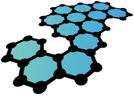 <b>Graphite</b></a></td>
    <td align="center"><a href="#ansible"> <b>Nagios</b></a></td>

  </tr>
  </tr>
    <tr>
    <td align="center">Main Purpose<b></b></td>
    <td align="center">Time series DB and monitoring system</td>
    <td align="center">Time Series DB and Graph rendering of the data</td>
    <td align="center">Monitoring system focused specifically on servers and network</td>
  </tr>
  <tr>
    <td align="center">OPEN SOURCE<b></b></td>
    <td align="center"><a href="#"> <b></b></a></td>
    <td align="center"><a href="#"> <b></b></a></td>
    <td align="center"><a href="#"> <b></b></a></td>
  </tr>
    <tr>
    <td align="center">Written in<b></b></td>
    <td align="center">Go</td>
    <td align="center">Python</td>
    <td align="center">C</td>
  </tr>
    <tr>
    <td align="center">API<b></b></td>
    <td align="center">RESTful HTTP and JSON<b></b></td>
    <td align="center">HTTP API Sockets</td>
    <td align="center">RESTful HTTP via Addon installation</td>
  </tr>
      <tr>
    <td align="center">Written in<b></b></td>
    <td align="center">Go</td>
    <td align="center">Go, Typescript and Python</td>
    <td align="center">?</td>
  </tr>
  <tr>
    <td align="center">Data Gathering<b></b></td>
    <td align="center">Pull (Exporters)</td>
    <td align="center">Push</td>
    <td align="center">Pull (Agents)</td>
  </tr>
  <tr>
    <td align="center">Alerts<b></b></td>
    <td align="center"><a href="#"> <b></b></a></td>
    <td align="center"><a href="#"> <b></b></a></td>
    <td align="center"><a href="#"> <b></b></a></td>
  </tr>
  <tr>
    <td align="center">Queries<b></b></td>
    <td align="center"><a href="#"> <b></b></a></td>
    <td align="center"><a href="#"> <b></b></a></td>
    <td align="center"><a href="#"> <b></b></a></td>
  </tr>
  <tr>
    <td align="center">Visualizations<b></b></td>
    <td align="center"><a href="#"> <b>Users mainly use Grafana for dashboards</b></a></td>
    <td align="center"><a href="#"> <b></b></a></td>
    <td align="center"><a href="#"> <b></b></a></td>
  </tr>

</table>

<!-- markdownlint-enable -->
<!-- prettier-ignore-end -->
<!-- ALL-TOPICS-LIST:END -->

## More Infra related projects

### Contribute
Contributions welcome! Read the [contribution guidelines](contributing.md) first.

### License

